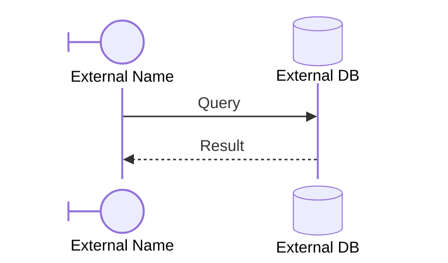

# Sequence Boundary and Database

This is the smallest docs example for the new sequence features that map closely to Mermaid participant kinds and arrow syntax.

**Spec:** `sequence-boundary-database.flow.json` · **Mode:** sequence · **Participants:** 2 · **Features:** boundary/database kinds, alias-style labels, explicit arrows

::FlaierDemo
---
src: /examples/sequence-boundary-database.flow.json
autoPlay: false
height: 440
---
::

## What it demonstrates

- Boundary and database participant kinds
- External display labels with stable internal participant ids
- Explicit `->>` and `-->>` arrow rendering
- A compact sequence that is easy to compare against Mermaid syntax
